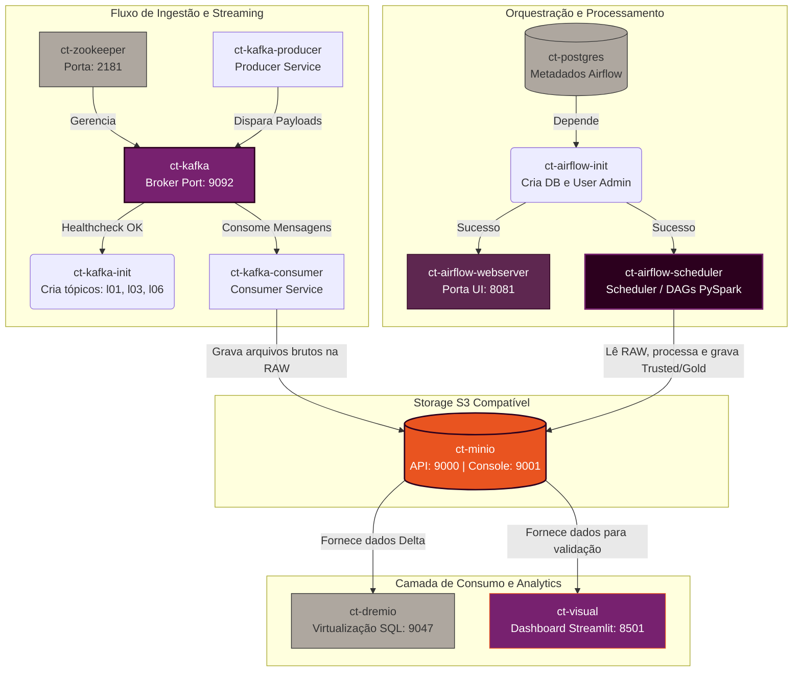

# 🚀 Projeto de TCC: Modern Data Lakehouse com Spark, Delta Lake e Kafka

## 📝 Descrição do Projeto
Este projeto implementa uma arquitetura de **Modern Data Lakehouse** para o processamento de fluxos de dados financeiros, sendo sustentado por uma **infraestrutura conteinerizada** via **Docker**, seguindo padrões de **DataOps**. Nesse sentido, ao utilizar o Docker Compose para orquestrar **Múltiplos Microserviços** (Kafka, Airflow e o storage MinIO), o projeto garante uma arquitetura reprodutível, isolada e escalável.


---

## 🏗️ Arquitetura do Sistema
A arquitetura segue o padrão de medalhão (*Medallion Architecture*):

* **Landing/Raw Zone**: Dados brutos consumidos de tópicos Kafka e armazenados em **Delta Tables**.
* **Trusted Zone**: Dados limpos e unificados, com schema definido e armazenados em **Delta Tables**.
* **Refined Zone (Gold)**: Dados modelados em **Star Schema** (Modelo Dimensional) prontos para consumo por ferramentas de BI, tambem em **Delta Tables**.

---

## 🛠️ Tecnologias Utilizadas
* **Orquestração:** Apache Airflow
* **Processamento de Dados:** Apache Spark (PySpark)
* **Armazenamento de Tabela:** Delta Lake (Transações ACID)
* **Storage (S3 Compatible):** MinIO
* **Mensageria:** Apache Kafka & Zookeeper
* **Banco de Dados (Metadata Airflow):** PostgreSQL
* **Infraestrutura:** Docker e Docker Compose
* **Visualização:** Dremio e Framework Streamlit

---

## 📊 Modelagem de Dados (Star Schema)
Abaixo descrevo os objetos por camadas

## Objetos por camadas
### Raw
* `l01`: Mensagens kafka armazenadas em delta tables de streaming de receitas
* `l03`: Mensagens kafka armazenadas em delta tables de streaming de despesas

### Truested
* `tab_despesa`: Mensagens kafka tipadas e formatadas de valores de despesas
* `tab_receita`: Mensagens kafka tipadas e formatadas de valores de despesas

### Refined
* `dim_contrato_divida`: Contrato de Dívidas.
* `dim_favorecido`: Favorecido.
* `dim_tipo_despesa`: Tipo de despesa.
* `dim_alinea_receita`: .
* `dim_item_receita`: Item da receita.
* `dim_origem_receita`: Origem da Receita.
* `dim_rubrica_receita`: Rubrica Receita.
* `fato_despesa`: Valores de despesas
* `fato_receita`: Valores de receitas



---

## 🚀 Como Executar o Projeto

### 1. Pré-requisitos
* Docker e Docker Compose instalados.
* Mínimo de 8GB de RAM (16GB recomendado).

### 2. Passo a Passo
1.  **Clonar o repositório:**
    ```bash
    git clone [https://github.com/ednilsonlomazi/data-pipeline-kafka-airflow-deltalake-docker-tcc.git](https://github.com/ednilsonlomazi/data-pipeline-kafka-airflow-deltalake-docker-tcc.git)
    cd tcc
    ```

2.  **Subir a infraestrutura:**
    ```bash
    sudo docker compose up -d --build
    ```

3.  **Acessar as interfaces:**
    * **Airflow:** `http://localhost:8081` (User: `admin` / Pass: `admin`)
    * **MinIO:** `http://localhost:9001` (User: `admin` / Pass: `password123`)


4.  **Executar as DAGs:**
    * **pipeline_trusted_tab_trafego:** Coleta mensagens de tópicos Kafka unindo em uma única Delta Table, a tab_trafego 
    * **refined_gera_dimensoes:** Coleta a tab_trafego e gera as dimensões do modelo
    * **refined_gera_fatos:** Coleta a tab_trafego e gera a fato

    * **trusted_deltatables_maintenance:** Dag criada para aplicar a otimização de arquivos parquet com Z-Order (agendada para todos os diais 00h)


